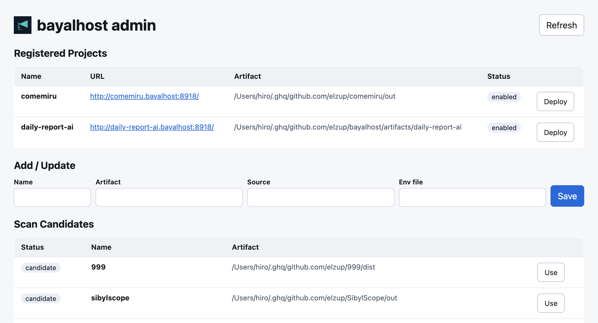

<div align="center">
  
  <h1>bayalhost</h1>
</div>

Host local static builds between your local dev server and production.

This repo is a lightweight static preview host for multiple projects. Each app is
served from a built `dist` directory on the host PC, without deploying to a
remote production environment.

## URL Model

Use wildcard DNS for the host PC:

```text
*.bayalhost -> <host-pc-ip>
```

For many projects on macOS, use `dnsmasq` instead of adding every hostname to
`/etc/hosts`:

```bash
./scripts/setup-dnsmasq-macos.sh
```

This creates:

```text
/opt/homebrew/etc/dnsmasq.d/bayalhost.conf
/etc/resolver/bayalhost
```

Result:

```text
*.bayalhost -> 127.0.0.1
```

Each project is served by subdomain:

```text
https://<project>.bayalhost
```

Examples:

```text
https://foo.bayalhost
https://admin.bayalhost
https://landing.bayalhost
```

Admin UI:

```text
https://admin.bayalhost
```

`admin.bayalhost` is reserved for project registration, scan results, and
deploy actions. Registered projects use `<project>.bayalhost`.

## Directory Layout

```text
bayalhost.config.json
sites/
  <project>/
    current -> releases/<timestamp>
    releases/
      <timestamp>/
        index.html
        assets/
        env.js
```

`current` is switched atomically after a new `dist` copy is complete.

## Project Registry

Copy the example config, then register your projects in
`bayalhost.config.json` (this file is git-ignored so it stays local):

```bash
cp bayalhost.config.example.json bayalhost.config.json
```

```json
{
  "name": "myapp",
  "source": "~/projects/myapp",
  "artifact": "~/projects/myapp/out",
  "envFile": "",
  "type": "static",
  "enabled": true
}
```

The schema is [schemas/bayalhost.schema.json](schemas/bayalhost.schema.json).

## CLI

List registered projects:

```bash
./scripts/bayalhost.mjs list
```

Scan candidates under configured `scanRoots`:

```bash
./scripts/bayalhost.mjs scan
```

Add or update a project:

```bash
./scripts/bayalhost.mjs add myapp ~/projects/myapp/out \
  --source ~/projects/myapp
```

Deploy from the registry:

```bash
./scripts/bayalhost.mjs deploy myapp
```

Validate registered projects:

```bash
./scripts/bayalhost.mjs validate
```

## Admin UI



Run the lightweight admin server:

```bash
./scripts/admin-server.mjs
```

It listens on `127.0.0.1:8918`. Caddy exposes it as:

```text
https://admin.bayalhost
```

The admin UI can:

- list registered projects
- scan configured roots for `out` / `dist` / `build`
- add or update project registry entries
- deploy a registered project

Direct fixed-port URL while Caddy is not running:

```text
http://admin.bayalhost:8918
```

## Deploy A Static Build

From this repo:

```bash
./scripts/deploy-dist.sh <project> /path/to/project/dist
```

For example, a Next.js static export at `~/projects/myapp/out`:

```bash
./scripts/deploy-dist.sh myapp ~/projects/myapp/out
```

That serves:

```text
https://myapp.bayalhost
```

With runtime environment variables:

```bash
./scripts/deploy-dist.sh <project> /path/to/project/dist /path/to/project/.env.bayalhost
```

The optional env file is rendered to:

```text
sites/<project>/current/env.js
```

The generated browser global is:

```js
window.__BAYALHOST_ENV__
```

In the app, include `/env.js` before the bundled app script when runtime config
is needed.

## Caddy

Install Caddy, then run from this repo:

```bash
caddy run --config Caddyfile
```

For a permanent service, point your launchd/systemd service at this repository
and run the same Caddyfile. Caddy is a good fit here because it is a single low
load process and can serve all projects through one wildcard host rule.

## Native Or Docker

Default to native Caddy for this use case:

- Static file serving is very low load.
- One native Caddy process can serve all projects.
- No per-project containers are needed for plain `out/` or `dist/` hosting.

Use Docker only when the middleware becomes meaningful:

- The host needs extra services beyond static files.
- A project requires process isolation.
- Reproducible runtime packaging matters more than idle resource usage.

macOS launchd auto-start. The plists under `launchd/` are templates that use a
`__REPO_DIR__` placeholder; the install script substitutes the real repo path
before loading them:

```bash
# admin only (default)
./scripts/install-launchd.sh admin

# admin + Caddy
./scripts/install-launchd.sh all
```

Logs:

```text
/tmp/bayalhost-caddy.out.log
/tmp/bayalhost-caddy.err.log
/tmp/bayalhost-admin.out.log
/tmp/bayalhost-admin.err.log
```

## Environment Variables

Static sites cannot read server process environment variables after build. Use
one of these patterns:

- Build-time env: set env vars before the project build; simplest, but every
  change requires rebuilding.
- Runtime env: pass an env file to `deploy-dist.sh`; it generates `env.js`, and
  changing env only requires re-running deploy.

Env file format:

```dotenv
API_BASE_URL=https://api.example.com
FEATURE_X=true
```

Lines beginning with `#` are ignored. Values are emitted as strings.

## Notes

- Project names must match `[a-z0-9-]+`.
- The Caddyfile uses `tls internal`, so clients may need to trust Caddy's local
  CA for clean HTTPS.
- If you do not want local HTTPS, remove `tls internal` and use HTTP-only
  addresses while testing.
